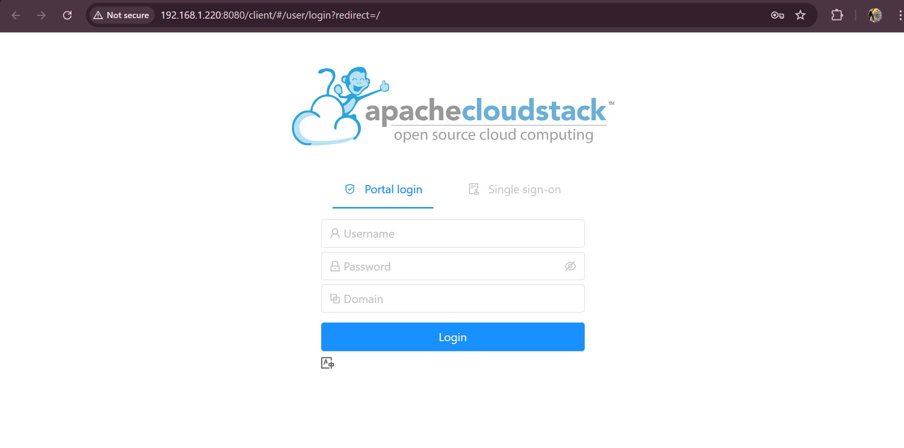
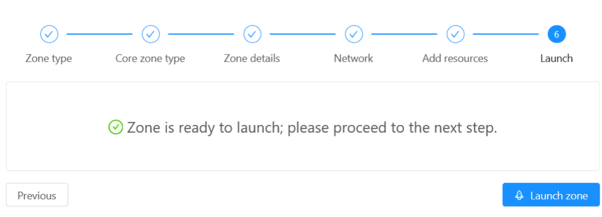
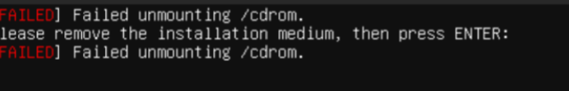
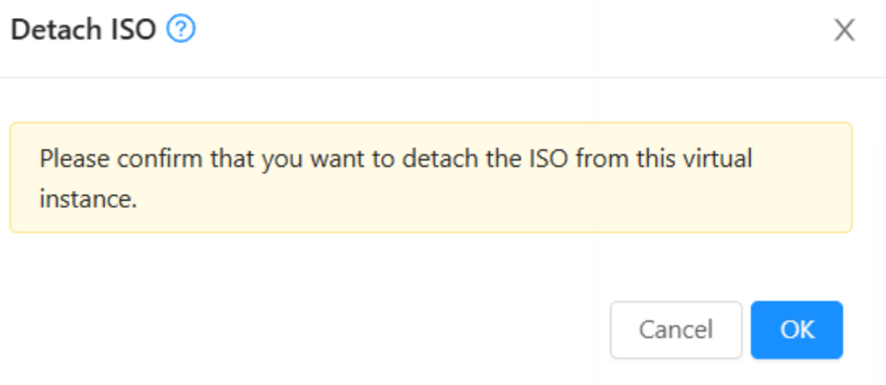

<!--
TODO: 
- Add Tailscale advertising to utils
- Refine the 05_website_configuration.md explanation
- Add more explanation to the 07_cloudstack_network_configuration.md
- Add Electrical Engineering Department in the contributor
- Add video explanatoin
  -->
# Single Node Apache Cloudstack Private Cloud Installation Guide


## Table of Contents

- [Single Node Apache Cloudstack Private Cloud Installation Guide](#single-node-apache-cloudstack-private-cloud-installation-guide)
  - [Table of Contents](#table-of-contents)
  - [Contributor](#contributor)
  - [Disclaimer](#disclaimer)
  - [Introduction](#introduction)
  - [Environment Set Up](#environment-set-up)
    - [Hardware Requirement](#hardware-requirement)
    - [Our Network Address](#our-network-address)
    - [Installing Nessessary Tools](#installing-nessessary-tools)
  - [Utils Set Up](#utils-set-up)
  - [Network Configuration](#network-configuration)
    - [Netplan](#netplan)
    - [Change the IP](#change-the-ip)
    - [Confirm Netplan](#confirm-netplan)
  - [Cloudstack Installation](#cloudstack-installation)
    - [Installing Cloudstack and Mysql Server](#installing-cloudstack-and-mysql-server)
    - [Configure Mysql Config File](#configure-mysql-config-file)
    - [Restart and check mysql service status](#restart-and-check-mysql-service-status)
    - [Deploy Database as Root and create user name and password](#deploy-database-as-root-and-create-user-name-and-password)
  - [Configure Cloudstack Host with KVM Hypervisor](#configure-cloudstack-host-with-kvm-hypervisor)
    - [Install KVM and Cloudstack Agent](#install-kvm-and-cloudstack-agent)
    - [Configure KVM Virtualization Management](#configure-kvm-virtualization-management)
    - [Libvirt TCP Configuration](#libvirt-tcp-configuration)
    - [Restart libvirtd](#restart-libvirtd)
    - [Configuration to Support Docker and Other Services](#configuration-to-support-docker-and-other-services)
    - [Generate Unique Host ID](#generate-unique-host-id)
    - [Restart libvirtd (after updating UUID)](#restart-libvirtd-after-updating-uuid)
    - [Configure Iptables Firewall](#configure-iptables-firewall)
    - [Disable AppArmor for libvirtd](#disable-apparmor-for-libvirtd)
  - [Website CloudStack Installation](#website-cloudstack-installation)
    - [Install Cloudstack Management Server](#install-cloudstack-management-server)
    - [Access the CloudStack Web Interface](#access-the-cloudstack-web-interface)
    - [Add a Zone → Network Configuration](#add-a-zone--network-configuration)
    - [Launch the Zone](#launch-the-zone)
  - [Cloudstack Configration and VM Installation](#cloudstack-configration-and-vm-installation)
    - [Download the ISO](#download-the-iso)
    - [Create a Compute Offering](#create-a-compute-offering)
    - [Create a New Instance](#create-a-new-instance)
    - [Cloudstack Network Configuration](#cloudstack-network-configuration)

## Contributor

- [Edgrant Henderson Suryajaya](https://github.com/EdgrantHS)
- [Miranti Anggunsari](https://www.github.com/rantiaaa)
- [Muhammad Rifki Pratama](https://github.com/MRifkiPratama)
- [Safia Amita Khoirunnisa](https://github.com/mitasafia)

## Disclaimer

> [!IMPORTANT]
> Our project is intended for Cloudstack installation and configuration on a single node (the host, management server, hypervisor, and storage) in a single machine. Cloudstack can also be set up in a multi-node environment, for that you can refer to other documentation.

## Introduction

Apache CloudStack is an open-source cloud computing platform for deploying and managing large networks of virtual machines. It provides Infrastructure as a Service (IaaS) via a web interface and API.

## Environment Set Up

### Hardware Requirement

```text
CPU: 4-core processor (Intel VT-x or AMD-V enabled)
RAM: Minimum 8 GB (16 GB recommended for smoother performance)
Storage: At least 100 GB free disk space (SSD preferred)
Network: 1 or more NICs (separate NICs recommended for management, public, and guest traffic)
Operating System: Ubuntu Server 22.04
```

### Our Network Address

The following configuration is based on our internal setup. Please adjust according to your own network environment.

```text
Network Address: 192.168.1.0/24
Host IP Address: 192.168.1.220
Gateway: 192.168.1.1
Management IP: 192.168.1.220
System IP: 192.168.1.221 - 192.168.1.225
Public IP: 192.168.1.226 - 192.168.1.230
```

### Installing Nessessary Tools

Update the system and install necessary tools, this might take a while.

```bash
sudo su
apt update -y
apt upgrade -y
apt install bridge-utils
```

## Utils Set Up

This step is optional, it helps maintain formatting but is not required to complete the installation.

The tools that we use are:

- **SSH:** Secure Shell, for remote access to the machine
- **Tailscale:** A VPN service that allows you to connect to your machine from anywhere
- **Lazyvim:** A Text Editor, more specifically a user friendly Neovim configuration

**<center>[Click for Detailed Utils Explanation](/details/01_utils.md)</center>**

## Network Configuration

The netplan configuration is similar to the network/wifi setting in Ubuntu Desktop/Windows, but we edit it using a file.

**<center>[Click for Detailed Network Explanation](/details/00_netplan.md)</center>**

### Netplan

```bash
cd /etc/netplan
sudo -e /etc/netplan/01-static-netcfg.yaml
```

### Change the IP

```yaml
# This is the network config written by 'subiquity'
network:
  version: 2
  renderer: networkd

  ethernets:
    enp0s3:
      dhcp4: false
      dhcp6: false
      optional: true

  bridges:
    cloudbr0:
      interfaces:
        - enp0s3
      addresses:
        - 192.168.1.220/24 #Your host IP address
      routes:
        - to: default
          via: 192.168.1.1
      nameservers:
        addresses:
          - 8.8.8.8
          - 8.8.4.4

      dhcp4: false
      dhcp6: false

      parameters:
        stp: false
        forward-delay: 0
```

### Confirm Netplan

```bash
sudo netplan get
sudo netplan apply
```

## Cloudstack Installation

Installing Apache CloudStack Management Server, database, and NFS configuration to prepare your cloud environment.

**<center>[Click for Detailed Installation Explanation](/details/03_cloudstack_installation.md)</center>**

### Installing Cloudstack and Mysql Server

Update package index and install the CloudStack Management Server and MySQL.

```bash
apt-get update -y
apt-get install cloudstack-management mysql-server
```

### Configure Mysql Config File

```bash
sudo -e/etc/mysql/mysql.conf.d/mysqld.cnf
```

```bash
server-id = 1
sql-mode="STRICT_TRANS_TABLES,NO_ENGINE_SUBSTITUTION,ERROR_FOR_DIVISION_BY_ZERO,NO_ZERO_DATE,NO_ZERO_IN_DATE,NO_ENGINE_SUBSTITUTION"
innodb_rollback_on_timeout=1
innodb_lock_wait_timeout=600
max_connections=1000
log-bin=mysql-bin
binlog-format = 'ROW'
```

### Restart and check mysql service status

Restart MySQL to apply changes and verify it's running.

```bash
systemctl restart mysql
systemctl status mysql
```

### Deploy Database as Root and create user name and password

Deploy the CloudStack database using root credentials and set up the default user.

```bash
cloudstack-setup-databases cloud:cloud@localhost --deploy-as=root:teep1 -i 192.168.1.220
```

---

## Configure Cloudstack Host with KVM Hypervisor

Installing and configuring a CloudStack host with KVM hypervisor, libvirt TCP access, unique host ID, and network settings to enable virtualization and agent communication.

**<center>[Click for Detailed CloudStack Host Configuration Explanation](/details/04_cloudstack_host.md)</center>**

### Install KVM and Cloudstack Agent

This command installs the QEMU-KVM hypervisor and the CloudStack agent, which enables the host to connect and communicate with the CloudStack management server.

```bash
apt-get install qemu-kvm cloudstack-agent -y
```

### Configure KVM Virtualization Management

This modifies the `libvirtd` default configuration to enable the daemon to listen for remote connections by setting `LIBVIRTD_ARGS="--listen"`.

```bash
sed -i.bak 's/^\(LIBVIRTD_ARGS=\).*/\1"--listen"/' /etc/default/libvirtd
```

### Libvirt TCP Configuration

These commands configure `libvirtd` to allow TCP connections without authentication. TLS is disabled, TCP is enabled on port 16509 (the default libvirt port), mDNS advertisement is turned off, and no authentication is required for TCP connections.

```bash
echo 'listen_tls = 0' >> /etc/libvirt/libvirtd.conf
echo 'listen_tcp = 1' >> /etc/libvirt/libvirtd.conf
echo 'tcp_port = "16509"' >> /etc/libvirt/libvirtd.conf
echo 'mdns_adv = 0' >> /etc/libvirt/libvirtd.conf
echo 'auth_tcp = "none"' >> /etc/libvirt/libvirtd.conf
```

### Restart libvirtd

This masks the default libvirt sockets that are not needed and restarts the `libvirtd` service to apply the changes.

```bash
systemctl mask libvirtd.socket libvirtd-ro.socket libvirtd-admin.socket libvirtd-tls.socket libvirtd-tcp.socket
systemctl restart libvirtd
```

### Configuration to Support Docker and Other Services

These kernel parameters are adjusted to prevent issues with Docker and other services by disabling bridge network calls to `iptables` and `arptables`.

```bash
echo "net.bridge.bridge-nf-call-iptables = 0" >> /etc/sysctl.conf
echo "net.bridge.bridge-nf-call-arptables = 0" >> /etc/sysctl.conf
sysctl -p
```

### Generate Unique Host ID

This installs the `uuid` package, generates a unique UUID for the host, and appends it to the `libvirtd` configuration to ensure each host has a distinct identifier.

```bash
apt-get install uuid -y
UUID=$(uuid)
echo host_uuid = "\"$UUID\"" >> /etc/libvirt/libvirtd.conf
```

This command generates a unique UUID and appends it to the `libvirtd.conf` file. It's important to ensure that in the `libvirtd.conf` file, the UUID is correctly inserted because it is very common for the UUID not to have a value.

To check if the UUID is correctly inserted, run the following command:

```bash
sudo -e /etc/libvirt/libvirtd.conf
```

Scroll to the bottom of the file and check if the UUID is correctly inserted. If it is not, repeat the command `UUID=$(uuid)` and check again. You need to delete the previous failed  host_uuid in the `libvirtd.conf` file.

if the UUID is inserted correctly, you should see something like this:

```bash
host_uuid = "a1b2c3d4-e5f6-7g8h-9i0j-k1l2m3n4o5p6"
```

if the UUID is not written correctly, you should see something like this:

```bash
host_uuid = ""
# or
host_uuid =
```

After repeating the command `UUID=$(uuid)` and checking again, you should see the UUID correctly inserted in the `libvirtd.conf` file.

```bash
host uuid = ""
host_uuid = "a1b2c3d4-e5f6-7g8h-9i0j-k1l2m3n4o5p6"
```

delete the previous failed host_uuid in the `libvirtd.conf` file.

### Restart libvirtd (after updating UUID)

The `libvirtd` service will be restarted again to apply the UUID configuration update.

```bash
systemctl restart libvirtd
```

### Configure Iptables Firewall

To enable proper communication between virtualization services, add the following rules for your local network (adjust `NETWORK` as needed):

```bash
NETWORK=192.168.1.0/24
```

Edit your persistent iptables rules:

```bash
sudo -e /etc/iptables/rules.v4
```

Append these rules:

```bash
iptables -A INPUT -s $NETWORK -m state --state NEW -p udp --dport 111 -j ACCEPT
iptables -A INPUT -s $NETWORK -m state --state NEW -p tcp --dport 111 -j ACCEPT
iptables -A INPUT -s $NETWORK -m state --state NEW -p tcp --dport 2049 -j ACCEPT
iptables -A INPUT -s $NETWORK -m state --state NEW -p tcp --dport 32803 -j ACCEPT
iptables -A INPUT -s $NETWORK -m state --state NEW -p udp --dport 32769 -j ACCEPT
iptables -A INPUT -s $NETWORK -m state --state NEW -p tcp --dport 892 -j ACCEPT
iptables -A INPUT -s $NETWORK -m state --state NEW -p tcp --dport 875 -j ACCEPT
iptables -A INPUT -s $NETWORK -m state --state NEW -p tcp --dport 662 -j ACCEPT
iptables -A INPUT -s $NETWORK -m state --state NEW -p tcp --dport 8250 -j ACCEPT
iptables -A INPUT -s $NETWORK -m state --state NEW -p tcp --dport 8080 -j ACCEPT
iptables -A INPUT -s $NETWORK -m state --state NEW -p tcp --dport 8443 -j ACCEPT
iptables -A INPUT -s $NETWORK -m state --state NEW -p tcp --dport 9090 -j ACCEPT
iptables -A INPUT -s $NETWORK -m state --state NEW -p tcp --dport 16514 -j ACCEPT
```

Make the rules persistent:

```bash
sudo apt-get install iptables-persistent
```

When prompted, answer **Yes** to save current rules.

### Disable AppArmor for libvirtd

Some versions of libvirt may require AppArmor to be disabled to work properly:

```bash
ln -s /etc/apparmor.d/usr.sbin.libvirtd /etc/apparmor.d/disable/
ln -s /etc/apparmor.d/usr.lib.libvirt.virt-aa-helper /etc/apparmor.d/disable/
apparmor_parser -R /etc/apparmor.d/usr.sbin.libvirtd
apparmor_parser -R /etc/apparmor.d/usr.lib.libvirt.virt-aa-helper
```

---

## Website CloudStack Installation

Installing the CloudStack Management Server

**<center>[Click for Detailed Website Installation Explanation](/details/01_utils.md)</center>**

### Install Cloudstack Management Server

```bash
cloudstack-setup-management
systemctl status cloudstack-management
tail -f /var/log/cloudstack/management/management-server.log
```

### Access the CloudStack Web Interface

Open your browser and access the host IP address port 8080.

> Example: `http://192.168.1.220:8080` if connected to the same network.  
> Example: `http://100.102.255.28` if using Tailscale.




Default Login:

```plaintext
Username: admin
Password: password
```

### Add a Zone → Network Configuration

---

**Select Zone Type**

You will be asked to choose the **zone type**:

- **Core**: Standard zone where main compute workloads run. Suitable for production environments.
- **Edge**: Lightweight zone typically used for edge computing (e.g., IoT, CDN, remote locations). May have limited resources or services.

> **Recommendation**: Select `Core` for a full-featured, general-purpose zone.

---

**Select Network Type**

Next, choose the **network type**:

- **Basic**: Flat network, no VLANs. Each VM gets a direct IP. Simpler setup.
- **Advanced**: Supports VLANs, virtual routers, and multiple guest networks. More flexibility.

> **Recommendation**: Select `Advanced` for most production use cases with isolation and rich networking features.

---

**Fill Zone Details**

| Field          | Example         | Description                     |
| -------------- | --------------- | ------------------------------- |
| Name           | `Final-Zone-12` | A descriptive name for the zone |
| IPv4 DNS 1     | `8.8.8.8`       | Public DNS server               |
| Internal DNS 1 | Host machine IP: `192.168.1.220` | Internal DNS for system VMs     |
| Hypervisor     | `KVM`           | Type of hypervisor used         |

---

**Configure Network**

**Add Physical Network**

Leave the physical network as default and click **"Next"**.

**Configure Public Traffic**

| Field    | Example         |
| -------- | --------------- |
| Gateway  | `192.168.1.1`   |
| Netmask  | `255.255.255.0` |
| Start IP | Unused IP in nework: `192.168.1.221` |
| End IP   | Unused IP in nework: `192.168.1.225` |

> These IPs are used for public access to VMs.

---

**Add Pod**

Each zone must have at least **one pod**, which contains clusters and hosts.
| Field | Example |
|-----------|-------------------|
| Name | `Final-Pod-12` |
| Gateway | `192.168.1.1` |
| Netmask | `255.255.255.0` |
| Start IP | Unused IP in nework: `192.168.1.226` |
| End IP | Unused IP in nework: `192.168.1.230` |

---

**Configure Guest Traffic**

- **VLAN/VNI Range**: `3300 - 3339`

> Used to isolate guest network traffic. Ensure VLANs are configured on your switch/router.

---

**Add Resources**

**Cluster**

- **Example Cluster Name**: `Final-Cluster-12`

> Clusters group hypervisor hosts that share storage and network configurations.

**Host**

| Field    | Example         |
| -------- | --------------- |
| Hostname | Host machine IP: `192.168.1.220` |
| Username | `root`          |
| Password | Host machine root Password: `******`        |

> Add you host machine IP address, username, and password.
> This is the host machine that will run the VMs.

**Primary Storage**

| Field    | Example             |
| -------- | ------------------- |
| Name     | `Final-Primstor-12` |
| Scope    | `Zone`              |
| Protocol | `NFS`               |
| Server   | Host machine IP: `192.168.1.220`     |
| Path     | `/export/primary`   |
| Provider | `DefaultPrimary`    |

> Primary storage holds VM disk volumes.

**Secondary Storage**

| Field    | Example             |
| -------- | ------------------- |
| Provider | `NFS`               |
| Name     | `Final-Secstor-2`   |
| Server   | Host machine IP: `192.168.1.220`       |
| Path     | `/export/secondary` |

> Secondary storage is used for templates, ISOs, and snapshots.

### Launch the Zone

Click **"Launch Zone"** to create the zone with the specified configurations. This process may take some time.



If successful, you will see a message indicating that the zone has been created.  If you encounter any issues, you can click the `Fix Issues` button and you will be redirected to the issue page and change the configuration.

It is common to encounter network issues, because the reserved IP address already used by another device in the network. You can assign a different reserved IP address and try again.

---

## Cloudstack Configration and VM Installation

### Download the ISO

Download the ISO file for the operating system you want to install on your VM.

Find your iso download link on the internet, make sure it is a direct link to the ISO file (ussually ends with `.iso`). For example, for Ubuntu Server 22.04:

```plaintext
https://releases.ubuntu.com/jammy/ubuntu-22.04.5-live-server-amd64.iso
```

From the sidebar, navigate to `Images` > `ISO` > `Register ISO`.

Fill in the Details:

| Field                   | Value            |
| ----------------------- | ---------------- |
| URL                    | `<your iso download link>` |
| Name                    | `<your iso name>` Ex: `Ubuntu Server 22.04` |
| Description             | `<your iso description>` Ex: `Ubuntu Server 22.04` |

Leave the rest as default.

This might take a while depending on your internet connection. You can check the status by clicking your iso name and going to the `Zone` tab.

### Create a Compute Offering

A **Compute Offering** defines the CPU, memory, and other compute resources allocated to virtual machines.

From the sidebar, navigate to `Compute Offering` > `Add Compute Offering`.

Fill in the Details:

| Field                   | Value            |
| ----------------------- | ---------------- |
| Name                    | `big`            |
| Description             | `big`            |
| Compute Offering Type   | `Fixed Offering` |
| CPU Cores               | `4`              |
| CPU (MHz)               | `1000`           |
| Memory (MB)             | `4096`           |
| Dynamic Scaling Enabled | `On`             |
| GPU                     | `None`           |
| Public                  | `Yes`            |

this will create a compute offering with 4 CPU cores and 4 GB of RAM. It is recommended to create this new offering because the default offering only has 1 CPU core which might cause the VM to be slow.

### Create a New Instance

From the sidebar, navigate to `Compute` > `Instances` > `New Instance`.

---

**Select Deployment Infrastructure**

- **Zone**: `<your zone name>` Ex: `Final-Zone-12`
- **Pod**: `<your pod name>` Ex: `Final-Pod-12`
- **Cluster**: `<your cluster name>` Ex: `Final-Cluster-12`
- **Host**: `<your host name>` Ex: `mizuki`

---

**Template/ISO**

- Click the `ISO` tab
- Choose from **My ISOs**
- Select your downloaded ISO

---

**Configure Network**

If you don’t have an existing network, create **Isolated** network:
| Field | Value |
|-------------------|--------------------------------------------|
| Name | `network-12` |
| Zone | `final-zone-12` |

> This network will provide isolated guest networking with outbound internet access.

---

**Configure Instance Details**

| Field             | Value                  |
| ----------------- | ---------------------- |
| Name              | `mizu7`                |
| Keyboard Language | `Standard US Keyboard` |

---

**Launch the Instance**

Click **"Launch Instance"**.  
CloudStack will provision your virtual machine based on the provided options.

---

**Ubuntu Server Installation**

This is the installation process for Ubuntu Server. Follow the on-screen instructions to complete the installation.

After the installation, you will be prompted to reboot. Then, after being prompted to remove the installation media, you can `detach iso` from the Instance page.





---

**Installation Complete**

Congratulations! You have successfully installed a Virtual Machine on your CloudStack environment. You can now access it via the console, but if you try to access the internet (Ex: `ping 8.8.8.8`), it will not work. This is because the network is not configured yet.

### Cloudstack Network Configuration

If you are using isolated network, you need to configure the network to allow the VM to access the internet and also configure port forwarding to access the VM using SSH.

---

**Configure Egress**

For the VM be able to access the internet, we need to configure the network.

- Go to `Network` > `Guest Network`
- Click your network name (Ex: `network-12`)
- Go to the `Egress` tab
- Add `0.0.0.0/0` to the `Source CIDR` and `Destination CIDR` fields. This will allow all traffic to go out of the network.
- Select `All` for the `Protocol` field.
- Click `Add`

After configuring this, you should see it update live in the VM console and be able to access the internet. Try to ping `ping 8.8.8.8` to check if it works.

You could install a VPN like Tailscale on the VM to access (SSH) it from anywhere. Another option is to configure port forwarding to access the VM using SSH if you are not using a VPN.

---

**Configure Port Forwarding**

To access the VM using SSH, we need to configure port forwarding and allow SSH traffic to go through the firewall.

Firewall Setup:

- Go to `Network` > `Public IP addresses`
- Click on the `Source NAT` IP address
- Go to the `Firewall` tab
- Add `0.0.0.0/0` to the `Source CIDR`
- Add `22` to the `Start Port` and `23` to the `End Port`
- Leave the `Protocol` as `TCP`

Port Forwarding Setup:

- Go to the `Port Forwarding` tab
- put `22` to the `Start Port` of both the private port and public port
- put `23` to the `End Port` of both the private port and public port
- Leave the `Protocol` as `TCP`
- Click `Add`
- Select the `VM` you want to forward the port to
- Click `OK`

You should now be able to access the VM using SSH from your personal computer using the source NAT IP address if you are in the same network. 
