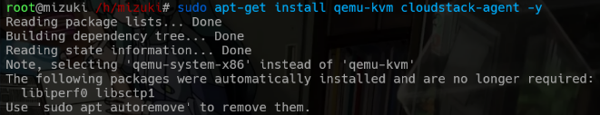
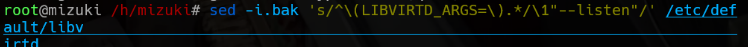
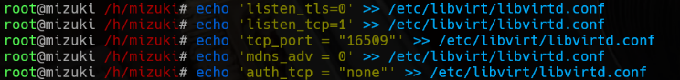
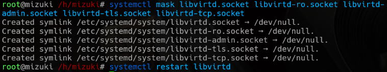
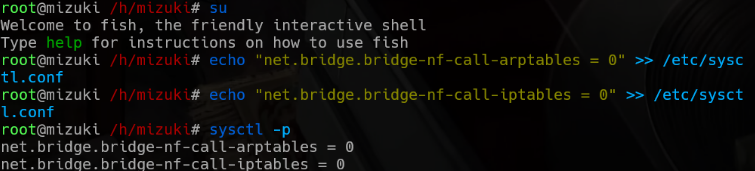
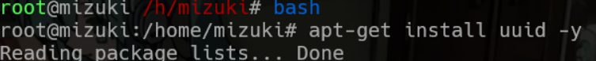
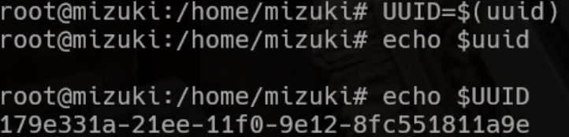
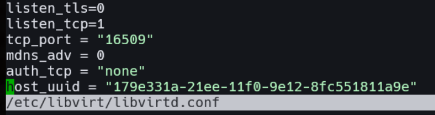
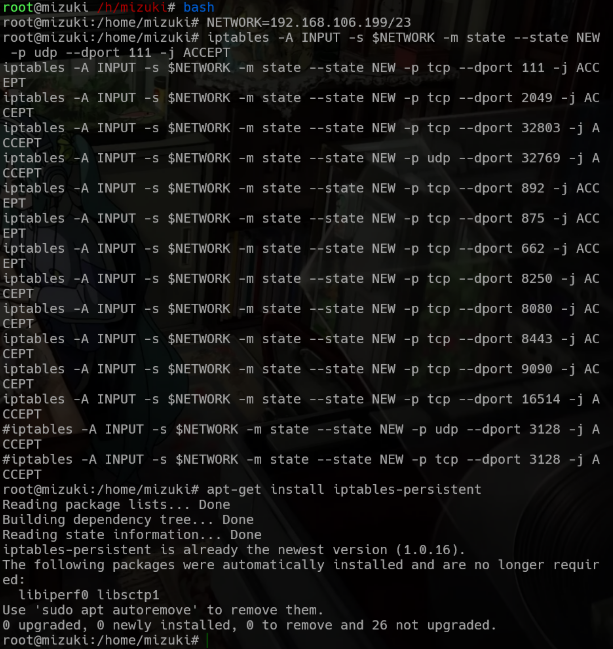
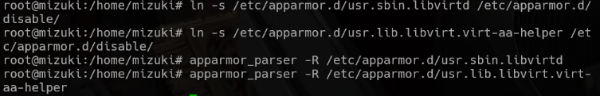

# Configure Cloudstack Host with KVM Hypervisor

- [Install KVM and CloudStack Agent](#install-kvm-and-cloudstack-agent)
- [Configure KVM Virtualization Management](#configure-kvm-virtualization-management)
- [Libvirt TCP Configuration](#libvirt-tcp-configuration)
- [Restart libvirtd](#restart-libvirtd)
- [Configuration to Support Docker and Other Services](#configuration-to-support-docker-and-other-services)
- [Generate Unique Host ID](#generate-unique-host-id)
- [Restart libvirtd (after updating UUID)](#restart-libvirtd-after-updating-uuid)
- [Configure Iptables Firewall](#configure-iptables-firewall)
- [Disable AppArmor for libvirtd](#disable-apparmor-for-libvirtd)
- [Additional Information](#additional-information)
- [Setup Validation](#setup-validation)
- [Common Error and How to Fix it](#common-error-and-how-to-fix-it)
- [Possible Warning](#possible-warning)

## Installing KVM and CloudStack Agent

Install the QEMU-KVM hypervisor and the CloudStack agent that enable host to connect and communicate with the CloudStack management server.

```bash
apt-get install qemu-kvm cloudstack-agent -y
```



## Configure KVM Virtualization Management

Modify the `libvirtd` default configuration to enable the daemon to listen for remote connections.

```bash
sed -i.bak 's/^\(LIBVIRTD_ARGS=\).*/\1"--listen"/' /etc/default/libvirtd
```



## Libvirt TCP Configuration

Allow TCP connections without authentication, disable TLS, enable TCP on default port, turn off mDNS advertisement.

```bash
echo 'listen_tls = 0' >> /etc/libvirt/libvirtd.conf
echo 'listen_tcp = 1' >> /etc/libvirt/libvirtd.conf
echo 'tcp_port = "16509"' >> /etc/libvirt/libvirtd.conf
echo 'mdns_adv = 0' >> /etc/libvirt/libvirtd.conf
echo 'auth_tcp = "none"' >> /etc/libvirt/libvirtd.conf
```



## Restart libvirtd

Mask the default libvirt sockets that are not needed and restarts the `libvirtd` service to apply the changes.

```bash
systemctl mask libvirtd.socket libvirtd-ro.socket libvirtd-admin.socket libvirtd-tls.socket libvirtd-tcp.socket
systemctl restart libvirtd
```



## Configuration to Support Docker and Other Services

Adjust kernel parameters to prevent issues with Docker and other services by disabling some bridge network.

```bash
echo "net.bridge.bridge-nf-call-iptables = 0" >> /etc/sysctl.conf
echo "net.bridge.bridge-nf-call-arptables = 0" >> /etc/sysctl.conf
sysctl -p
```



## Generate Unique Host ID

Install the `uuid` packages and generated a unique ID for every host.

```bash
apt-get install uuid -y
UUID=$(uuid)
echo host_uuid = "\"$UUID\"" >> /etc/libvirt/libvirtd.conf
```



> **Note:** If the UUID is not written correctly into the configuration file, repeat the command `UUID=$(uuid)` and verify with:
>
> ```bash
> nvim /etc/libvirt/libvirtd.conf
> ```
> 
> 

## Restart libvirtd (after updating UUID)

Restart `libvirtd` service once again to apply the UUID configuration update.

```bash
systemctl restart libvirtd
```

## Configure Iptables Firewall

To enable proper communication between virtualization services, add the following rules for your local network (adjust `NETWORK` as needed):

```bash
NETWORK=192.168.1.0/24
```

Edit your persistent iptables rules:

```bash
sudo -e /etc/iptables/rules.v4
```

Append these rules:

```bash
iptables -A INPUT -s $NETWORK -m state --state NEW -p udp --dport 111 -j ACCEPT
iptables -A INPUT -s $NETWORK -m state --state NEW -p tcp --dport 111 -j ACCEPT
iptables -A INPUT -s $NETWORK -m state --state NEW -p tcp --dport 2049 -j ACCEPT
iptables -A INPUT -s $NETWORK -m state --state NEW -p tcp --dport 32803 -j ACCEPT
iptables -A INPUT -s $NETWORK -m state --state NEW -p udp --dport 32769 -j ACCEPT
iptables -A INPUT -s $NETWORK -m state --state NEW -p tcp --dport 892 -j ACCEPT
iptables -A INPUT -s $NETWORK -m state --state NEW -p tcp --dport 875 -j ACCEPT
iptables -A INPUT -s $NETWORK -m state --state NEW -p tcp --dport 662 -j ACCEPT
iptables -A INPUT -s $NETWORK -m state --state NEW -p tcp --dport 8250 -j ACCEPT
iptables -A INPUT -s $NETWORK -m state --state NEW -p tcp --dport 8080 -j ACCEPT
iptables -A INPUT -s $NETWORK -m state --state NEW -p tcp --dport 8443 -j ACCEPT
iptables -A INPUT -s $NETWORK -m state --state NEW -p tcp --dport 9090 -j ACCEPT
iptables -A INPUT -s $NETWORK -m state --state NEW -p tcp --dport 16514 -j ACCEPT
```

Make the rules persistent:

```bash
sudo apt-get install iptables-persistent
```



> When prompted, answer **Yes** to save current rules.

## Disable AppArmor for libvirtd

Some versions of libvirt may require AppArmor to be disabled to work properly:

```bash
ln -s /etc/apparmor.d/usr.sbin.libvirtd /etc/apparmor.d/disable/
ln -s /etc/apparmor.d/usr.lib.libvirt.virt-aa-helper /etc/apparmor.d/disable/
apparmor_parser -R /etc/apparmor.d/usr.sbin.libvirtd
apparmor_parser -R /etc/apparmor.d/usr.lib.libvirt.virt-aa-helper
```



---

## Additional Information

* **CloudStack agent configuration located in**: `/etc/cloudstack/agent/agent.properties`
* **Logs can be found in**:
  * Libvirt logs: `/var/log/libvirt/`
  * CloudStack agent logs: `/var/log/cloudstack/agent/agent.log`
* **Default libvirt TCP port**: `16509`
* **Useful services to check**:

  ```bash
  systemctl status libvirtd
  systemctl status cloudstack-agent
  ```

---

## Setup Validation

Run these command to ensure everything is successfully set up.

### 1. Check if Libvirt TCP Listening

```bash
netstat -tulnp | grep 16509
```

Output should show `libvirtd` listening on `0.0.0.0:16509`.

### 2. Validate CloudStack Agent Status

```bash
systemctl status cloudstack-agent
```

Should show `active (running)` without repeated restart attempts.

### 3. Connect from CloudStack UI

* Go to **Infrastructure > Hosts**
* Add the KVM host IP and credentials.
* Host should register successfully and appear as "Enabled".

### 4. Ping Libvirt from Management Server

```bash
virsh -c qemu+tcp://<host-ip>/system list
```

From the management server, this should return an empty list or running VMs.

### 5. Validate iptables

```bash
sudo iptables -L -n | grep 8080
```

### 5. Check AppArmor status

```bash
sudo aa-status
```

Should not list libvirtd under active profiles.

---

## Common Error and How to Fix It

| Error Message / Symptom                           | Cause                                    | Fix                                                      |
| ------------------------------------------------- | ---------------------------------------- | -------------------------------------------------------- |
| `libvirtd not listening on TCP port`              | Daemon misconfigured or not restarted    | Re-check `libvirtd.conf` and rerun restart               |
| CloudStack cannot add host                        | Agent not running or blocked by firewall | Check `cloudstack-agent`, open port 16509                |
| `Unable to connect to libvirt`                    | Auth config issue or host UUID missing   | Ensure `auth_tcp="none"` and `host_uuid` is set          |
| `bridge-nf-call-iptables` related error in Docker | Kernel sysctl values not set             | Re-run `sysctl -p` after appending to `/etc/sysctl.conf` |
| AppArmor denial messages in logs  | AppArmor blocking libvirt                | Disable as shown above |

---

## Possible Warning

Not all warnings require action. Here's a general rule on this case:

* **Safe to ignore**:

  * Warnings like "default TLS port not enabled"
  * Notices about deprecated configs (if not impacting functionality)
  * When `iptables-persistent: Warning on boot` warning shown, as long as rules load with `iptables -L`.

* **Must NOT ignore**:

  * Errors that prevent the agent or `libvirtd` from starting
  * Duplicate UUID or failed host registration
  * Authentication or permission denied errors

To ensure everything is running well, monitor logs using this command.

```bash
tail -f /var/log/cloudstack/agent/agent.log
journalctl -xe
```