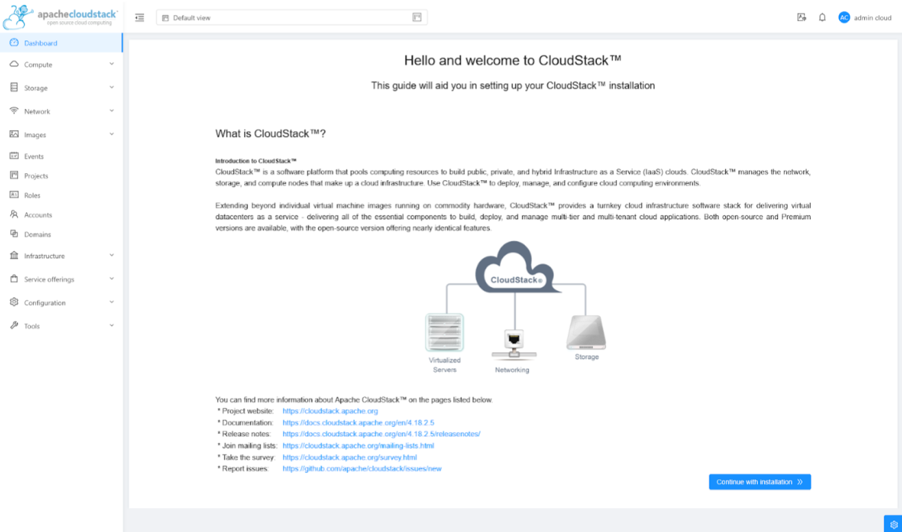
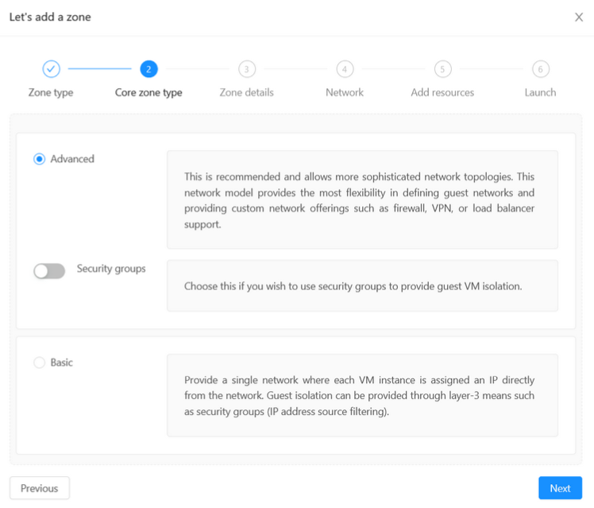
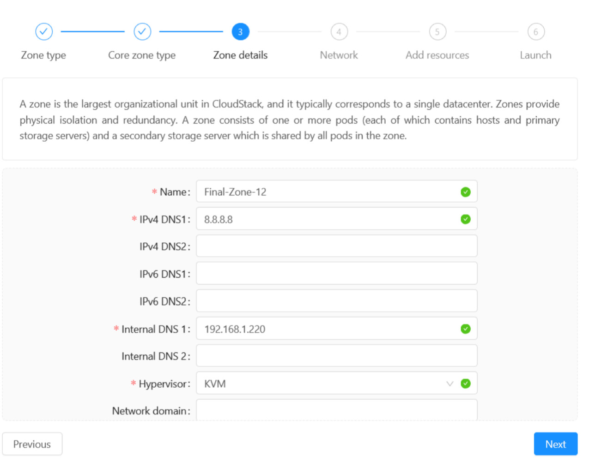
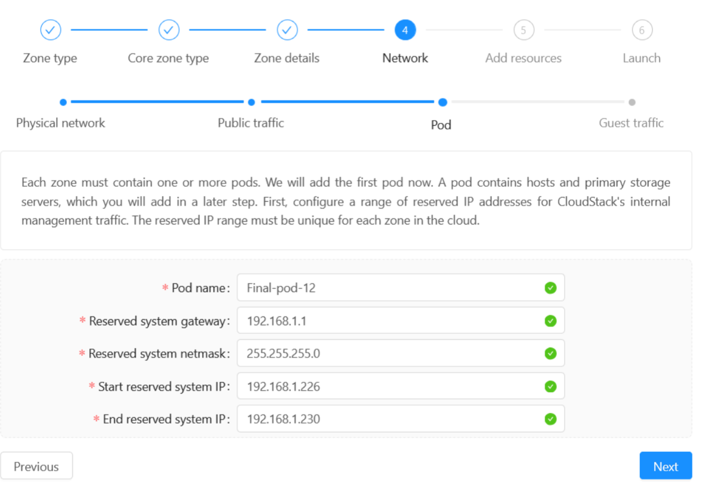
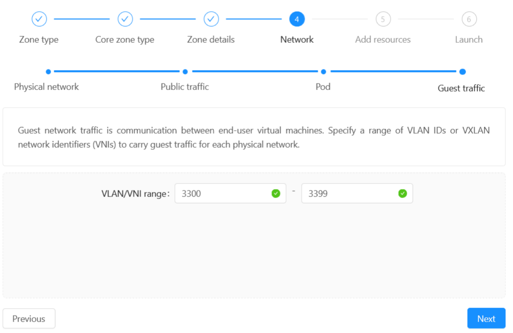
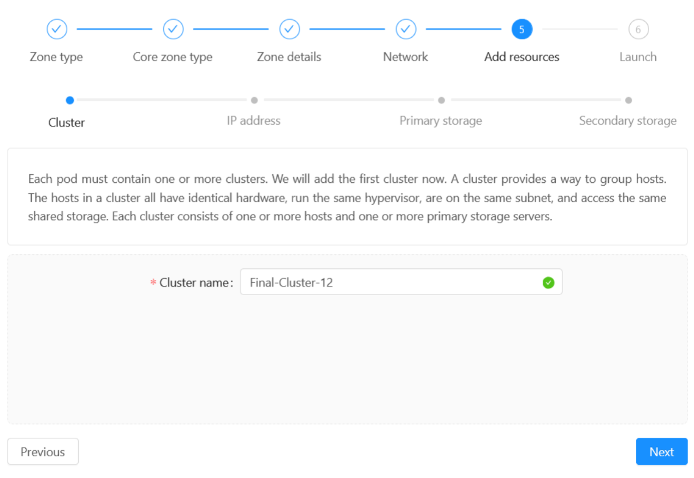
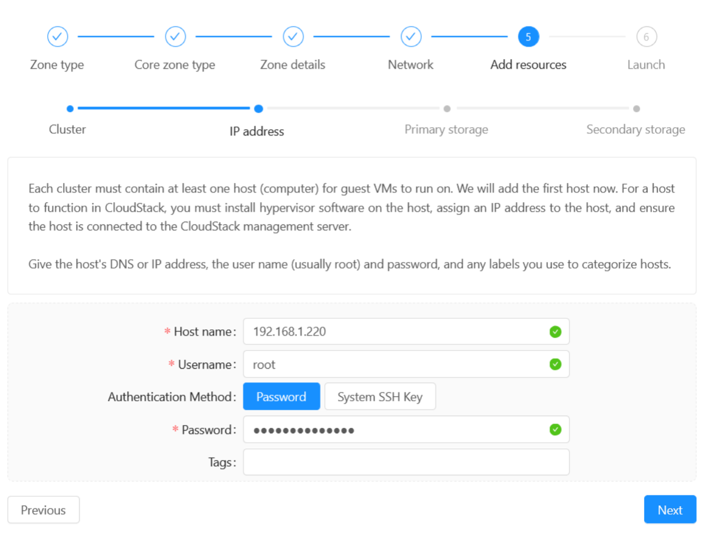
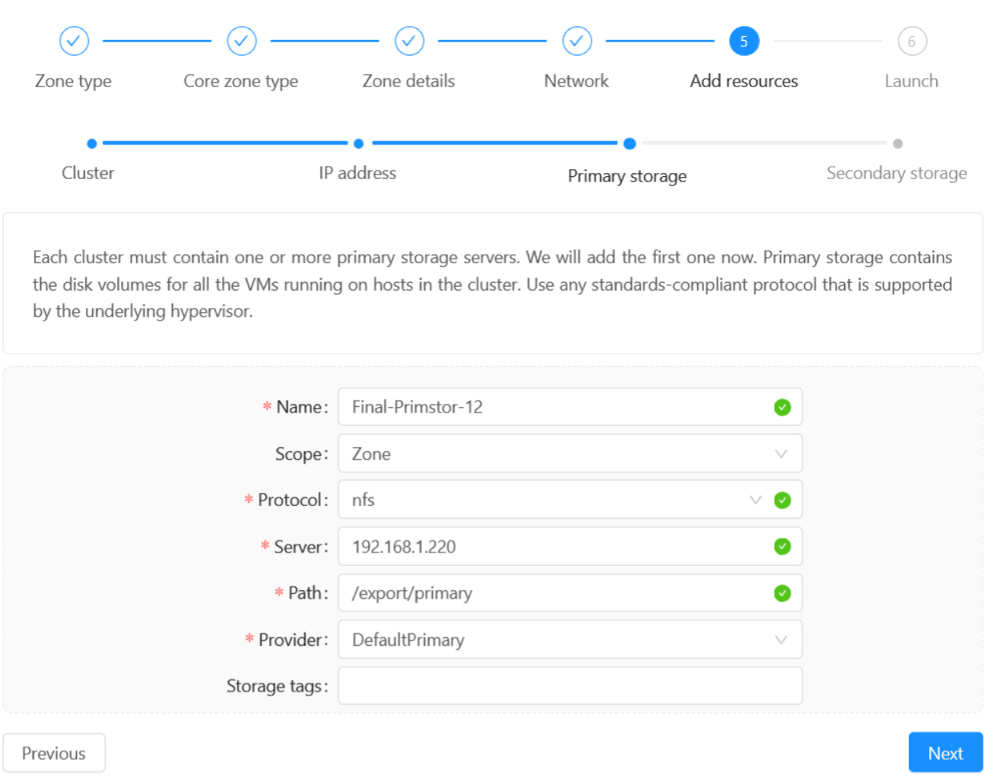

# Website CloudStack Installation

In this page, we will install the CloudStack Management Server, including setting up zones, pods, hosts, and storage.

## Table of Contents

- [Website CloudStack Installation](#website-cloudstack-installation)
  - [Table of Contents](#table-of-contents)
  - [Install Cloudstack Management Server](#install-cloudstack-management-server)
  - [Access the CloudStack Web Interface](#access-the-cloudstack-web-interface)
  - [Add a Zone → Network Configuration](#add-a-zone--network-configuration)
    - [Select Zone Type](#select-zone-type)
    - [Select Network Type](#select-network-type)
    - [Fill Zone Details](#fill-zone-details)
    - [Configure Network](#configure-network)
    - [Add Pod](#add-pod)
    - [Configure Guest Traffic](#configure-guest-traffic)
    - [Add Resources](#add-resources)
  - [Launch the Zone](#launch-the-zone)

## Install Cloudstack Management Server

To install the CloudStack Management Server, run the following commands:

```bash
cloudstack-setup-management
systemctl status cloudstack-management
tail -f /var/log/cloudstack/management/management-server.log
```

This will set up the management server and start the service. You can check the status of the service using the `systemctl status` command.

Running the `tail -f /var/log/cloudstack/management/management-server.log` command will show you the real-time logs of the management server. This is useful for debugging and checking if the server is running correctly.

Installing this will take a while, so be patient. You can check wether the installation is successful by checking the logs. If the log speed slows down and start showing Health check messages, it means the installation is successful and you can proceed to the next step.


## Access the CloudStack Web Interface

Open your browser and access the host IP address port 8080.

> Example: `http://192.168.1.220:8080` if connected to the same network.  
> Example: `http://100.102.255.28` if using Tailscale.


Default Login:

```plaintext
Username: admin
Password: password
```

After logging in, you will be at the start page of the CloudStack web interface. Click the `Continue with Installation` button to proceed.



First, you will be asked to change the password. Enter a new password and click `Change Password`.


## Add a Zone → Network Configuration

### Select Zone Type

You will be asked to choose the **zone type**:

- **Core**: Standard zone where main compute workloads run. Suitable for production environments.
- **Edge**: Lightweight zone typically used for edge computing (e.g., IoT, CDN, remote locations). May have limited resources or services.

> **Recommendation**: Select `Core` for a full-featured, general-purpose zone.


### Select Network Type

Next, choose the **network type**:

- **Basic**: Flat network, no VLANs. Each VM gets a direct IP. Simpler setup.
- **Advanced**: Supports VLANs, virtual routers, and multiple guest networks. More flexibility.



> **Recommendation**: Select `Advanced` for most production use cases with isolation and rich networking features.

When you select `Advanced`, you will later on need to configure the network settings to be able for the VM to access the internet. If choose `Basic`, the internet should work out of the box, but if it does not, it will be difficult to troubleshoot.

### Fill Zone Details

| Field          | Example         | Description                     |
| -------------- | --------------- | ------------------------------- |
| Name           | `Final-Zone-12` | A descriptive name for the zone |
| IPv4 DNS 1     | `8.8.8.8`       | Public DNS server               |
| Internal DNS 1 | Host machine IP: `192.168.1.220` | Internal DNS for system VMs     |
| Hypervisor     | `KVM`           | Type of hypervisor used         |



Be sure to input your host machine IP address in the **Internal DNS 1** field. Another alternative is to use `127.0.0.1`

### Configure Network

**Add Physical Network**

Leave the physical network as default and click **"Next"**.
  
**Configure Public Traffic**

| Field    | Example         |
| -------- | --------------- |
| Gateway  | `192.168.1.1`   |
| Netmask  | `255.255.255.0` |
| Start IP | Unused IP in nework: `192.168.1.221` |
| End IP   | Unused IP in nework: `192.168.1.225` |

These IPs are used for public access to VMs. Make sure they are not already in use. The **Start IP** and **End IP** should be within the same subnet as the **Gateway**.


### Add Pod

Each zone must have at least **one pod**, which contains clusters and hosts.
| Field | Example |
|-----------|-------------------|
| Name | `Final-Pod-12` |
| Gateway | `192.168.1.1` |
| Netmask | `255.255.255.0` |
| Start IP | Unused IP in nework: `192.168.1.226` |
| End IP | Unused IP in nework: `192.168.1.230` |

These IPs are used for the pod's management network. Make sure they are also not already in use. The **Start IP** and **End IP** should be within the same subnet as the **Gateway**.



### Configure Guest Traffic

- **VLAN/VNI Range**: `3300 - 3339`

> Used to isolate guest network traffic. Ensure VLANs are configured on your switch/router.



### Add Resources

**Cluster**

- **Example Cluster Name**: `Final-Cluster-12`

> Clusters group hypervisor hosts that share storage and network configurations.



**Host**

| Field    | Example         |
| -------- | --------------- |
| Hostname | Host machine IP: `192.168.1.220` |
| Username | `root`          |
| Password | Host machine root Password: `******`        |

> Add you host machine IP address, username, and password.
> This is the host machine that will run the VMs.

Make sure to use the host machine IP address, not the Tailscale IP address. Also, make sure to use the root user and password of the host machine. If it is incorrect, you will be asked to fix the issue later when you click the **"Launch Zone"** button.



**Primary Storage**

| Field    | Example             |
| -------- | ------------------- |
| Name     | `Final-Primstor-12` |
| Scope    | `Zone`              |
| Protocol | `NFS`               |
| Server   | Host machine IP: `192.168.1.220`     |
| Path     | `/export/primary`   |
| Provider | `DefaultPrimary`    |

> Primary storage holds VM disk volumes.

Make sure theIP address is the host machine IP address, also make sure the path is `/export/primary`. We've created this directory in the host machine before. If it does not exist, refer to the previous steps to create it.



**Secondary Storage**

| Field    | Example             |
| -------- | ------------------- |
| Provider | `NFS`               |
| Name     | `Final-Secstor-2`   |
| Server   | Host machine IP: `192.168.1.220`       |
| Path     | `/export/secondary` |

> Secondary storage is used for templates, ISOs, and snapshots.

Make sure the IP address is the host machine IP address, also make sure the path is `/export/secondary`. We've created this directory in the host machine before. If it does not exist, refer to the previous steps to create it.


## Launch the Zone

Click **"Launch Zone"** to create the zone with the specified configurations. This process may take some time.


If successful, you will see a message indicating that the zone has been created.  If you encounter any issues, you can click the `Fix Issues` button and you will be redirected to the issue page and change the configuration.

It is common to encounter network issues, because the reserved IP address already used by another device in the network. You can assign a different reserved IP address and try again.